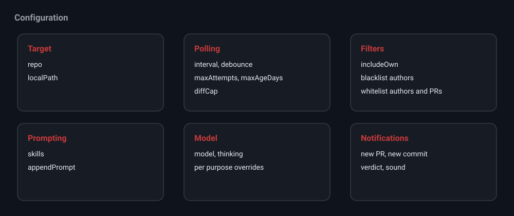

# Configuration

Every setting lives on the workspace and is edited in the Review mode settings
panel. Configs are persisted to `data/sessions.json`. Defaults match the
original pr-review-bot.

## Target

| Field | Default | Description |
| --- | --- | --- |
| `repo` | empty | Target repository as `owner/name`. Full GitHub URLs are normalized. |
| `localPath` | empty | Path to an existing local clone. Used as the pi working directory in Implement mode. |

## Polling

| Field | Default | Description |
| --- | --- | --- |
| `interval` | 60 | Poll interval in seconds. |
| `debounceMinutes` | 0 | Require the head commit to be at least this old before reviewing. 0 disables it. |
| `maxAttempts` | 3 | Retries per commit before giving up. |
| `maxAgeDays` | 14 | Ignore PRs opened more than this many days ago. |
| `diffCapBytes` | 200000 | Truncate diffs larger than this. |

## Filters

| Field | Default | Description |
| --- | --- | --- |
| `includeOwn` | false | Also review PRs you authored. |
| `blacklistAuthors` | empty | Skip PRs from these authors. |
| `whitelistAuthors` | empty | When set, only review PRs from these authors. |
| `whitelistPrs` | empty | When set, only review these PR numbers. |

## Prompting

| Field | Default | Description |
| --- | --- | --- |
| `skills` | empty | Absolute skill paths forwarded to pi. |
| `appendPrompt` | empty | Extra instructions appended to the review prompt. |

## Model

| Field | Default | Description |
| --- | --- | --- |
| `model` | provider default | Model and thinking level for the workspace. |
| `reviewModel` | inherits | Optional override for review sub sessions. |
| `visualizationModel` | inherits | Optional override for visualization. |
| `implementModel` | inherits | Optional override for the Implement chat. |

Models are sourced from your pi configuration. Thinking levels range from `off`
to `xhigh`. Some models only accept certain thinking levels; if a review returns
an error about the thinking parameter, lower the level or pick another model.

## Notifications

| Field | Default | Description |
| --- | --- | --- |
| `notifyOnNewPr` | true | Notify when a new PR is detected. |
| `notifyOnNewCommit` | true | Notify when a new commit lands on a seen PR. |
| `notifyOnVerdict` | true | Notify when a verdict is ready to review. |
| `sound` | false | Play a short sound with notifications. |
