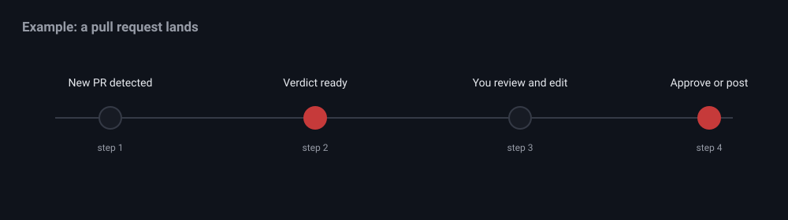

# Examples

A walkthrough of the everyday flow, from a pull request landing to a posted
review.



## Review and approve a pull request

1. Create a workspace and set the repository, then press Start.
2. When a PR lands, the poller reviews it and a verdict ready notification fires.
3. Open the queued item. Read the summary and the change visualization, then
   edit or delete any suggested comments.
4. Press Approve or Post suggestions. nit posts to GitHub only on that click.

## Scope the poller to specific PRs

Set a PR whitelist so nit only reviews the numbers you care about.

```bash
curl -X PATCH http://localhost:3000/api/sessions/<id> \
  -H 'Content-Type: application/json' \
  -d '{"whitelistPrs":["2058","2050"]}'
```

## Trigger a single poll from the command line

```bash
curl -X POST http://localhost:3000/api/sessions/<id>/action \
  -H 'Content-Type: application/json' \
  -d '{"action":"poll_now"}'
```

## Fix an issue in Implement mode

1. While reviewing, toggle Implement mode.
2. Ask the agent to make the change, for example: "add input validation to the
   handler in src/api and run the tests".
3. Use the git panel to create a branch, commit, push, and open a PR.

## Watch events as they happen

```bash
curl -N http://localhost:3000/api/events
```

Each line is a server sent event, including session updates, log lines, and
notifications.
