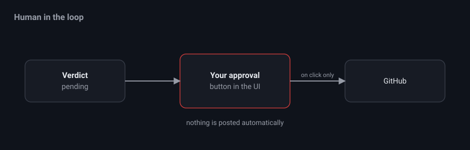

# FAQ

## Does nit post to GitHub automatically?

No. Every verdict waits in the approval queue. Nothing is posted until you press
Approve or Post suggestions.

## Where are credentials stored?

nit stores none of its own. It reuses your pi configuration under `~/.pi/agent`
for models and auth, and your existing gh auth for GitHub. git runs against your
local clone.

## Which models can I use?

Any model configured for pi that has valid credentials. The picker is populated
from `/api/models`. Thinking levels range from off to xhigh. If a review fails
with an error about the thinking parameter, the selected model does not accept
that level, so lower it or choose another model.

## Where is state kept?

Under `data/` next to the server, mirroring the original pr-review-bot format.

- `data/sessions.json` holds workspace configs.
- `data/sessions/<id>/state.json` holds completed reviews keyed by `repo#pr@sha`.
- `data/sessions/<id>/queue.json` holds approval queue items.
- `data/sessions/<id>/logs/YYYY-MM-DD.log` holds daily logs.
- `data/sessions/<id>/pr-<n>/` holds cached HTML visualizations.

## Do pollers keep running if I close the browser?

Yes. Pollers live in the server process, not the tab. On restart, workspaces
with the poller enabled resume automatically.

## Can multiple workspaces run at once?

Yes. A global cap limits how many review and visualization sub sessions run at
the same time. Set `NIT_CONCURRENCY` to change it. The default is 2.
