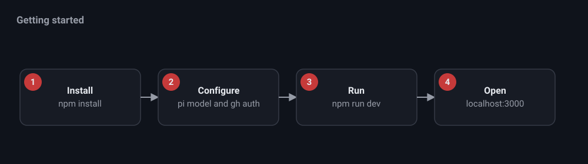

# Getting started



## Requirements

- Node 20. This matches the bundled pi SDK.
- The GitHub CLI, authenticated with `gh auth login`.
- git.
- pi configured with a provider and model under `~/.pi/agent`. nit reuses that
  auth and those models and stores no secrets of its own.

## Install

```bash
npm install
```

## Run

```bash
npm run dev
```

The custom server starts on http://localhost:3000 with hot reload. Set `PORT`
to change the port, and `NIT_CONCURRENCY` to change the cap on simultaneous
review and visualization sub sessions. The default cap is 2.

For a production build:

```bash
npm run build
npm start
```

## First workspace

1. Open http://localhost:3000 and click New workspace.
2. Open settings in Review mode and set a Repository. You can paste an
   `owner/name` value or a full GitHub URL. For Implement mode, also set a local
   clone path.
3. Press Start to begin polling, or Poll for a single cycle. Reviews appear in
   the approval queue.
4. Toggle Implement to chat with the pi agent and use the git panel.

Nothing is posted to GitHub until you approve or post suggestions with a button.
