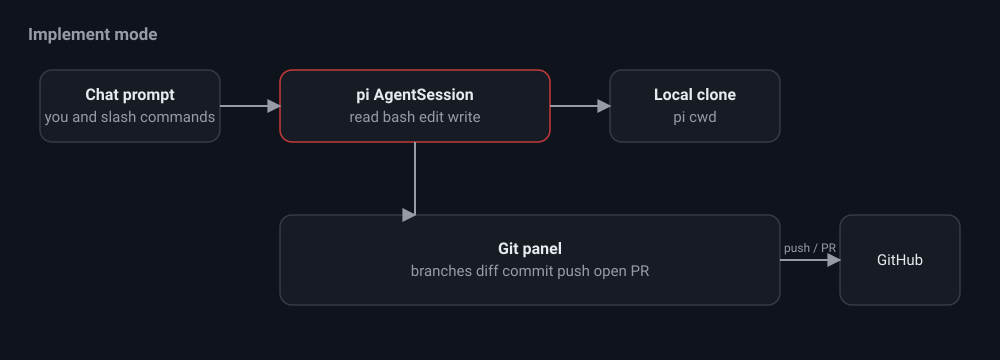

# Implement mode

Implement mode is a full pi coding session on a local clone of the repository,
paired with a git panel. Use it to fix an issue you spotted while reviewing, then
push a branch and open a PR without leaving nit.

## The chat

The chat is an interactive pi AgentSession created lazily for the workspace. It
uses the coding tools read, bash, edit, and write, with the working directory
set to the local clone path. The session is persisted as a native pi JSONL
session, so history survives restarts and is openable by the pi CLI.

- Streaming responses arrive over server sent events.
- Type `/` to see the slash commands discovered from your pi prompt templates.
- Send a message while the agent is working to queue a follow up.

## The git panel

The git panel drives common actions through the local git and gh binaries:

- Switch branches or create a new branch.
- View the working tree status and the diff.
- Stage all changes and commit with a message.
- Push the current branch.
- Open a pull request for the current branch.

The agent can also run any of these through its bash tool, so the panel and the
chat stay in sync.

## Choosing the working directory

Set the local clone path in Review mode settings. Implement mode requires it,
because the pi session and the git panel both operate inside that directory.
