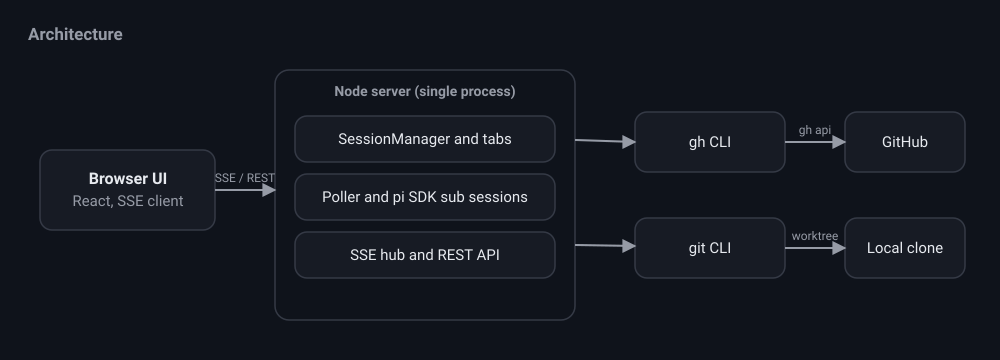

# nit

nit is a PR centric coding agent. It watches a GitHub repository for pull
requests, reviews each incoming PR with a headless pi session, shows you an
auto generated HTML visualization of the changes, and lets you approve or post
suggestions with a button. It also runs as a full pi coding agent so you can
implement fixes in a local clone without leaving the app.

## How it fits together

nit is a single long lived Node process. A custom server hosts an in memory
SessionManager, the pollers, the embedded pi SDK sessions, and a server sent
events hub. The browser is a thin view over that state. The GitHub CLI and git
run as child processes, so nit reuses your existing credentials and stores no
secrets of its own.

## Two modes per workspace

Each tab is a workspace bound to one repository, with a toggle between two
modes.

- Review PR mode polls the repository, reviews incoming PRs read only, notifies
  you on new PRs and new commits, generates an HTML change visualization, and
  holds every verdict in an approval queue. Nothing is posted to GitHub until
  you press a button.
- Implement mode is an interactive pi coding session on a local clone, with a
  git panel for branches, diffs, commit, push, and open PR.

## What to read next

- [Getting started](./getting-started.md) to install and run nit.
- [Review mode](./review-mode.md) for the human in the loop review flow.
- [Implement mode](./implement-mode.md) for the coding agent and git panel.
- [Configuration](./configuration.md) for every setting.
- [API reference](./reference.md) for the REST and streaming endpoints.
