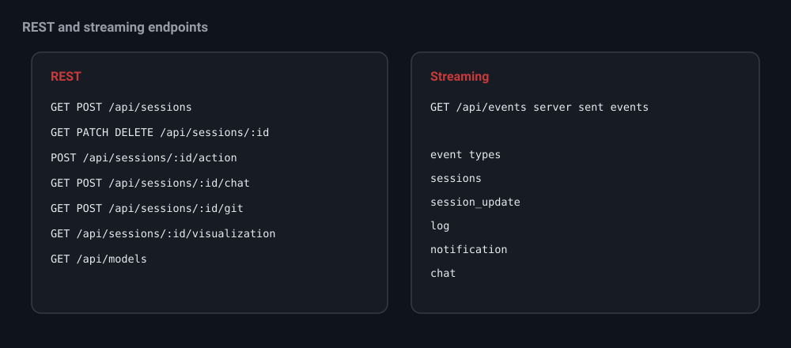

# API reference

nit exposes a small REST surface plus one server sent events stream. Everything
the browser does maps to these endpoints, so you can script nit from the command
line too.

## Sessions

| Method | Path | Description |
| --- | --- | --- |
| GET | `/api/sessions` | List all workspaces as snapshots. |
| POST | `/api/sessions` | Create a workspace. Body `{ name }`. |
| GET | `/api/sessions/:id` | Snapshot plus the tail of the daily log. |
| PATCH | `/api/sessions/:id` | Update the config. Body is a partial config. |
| DELETE | `/api/sessions/:id` | Delete a workspace. |

## Actions

`POST /api/sessions/:id/action` with a body `{ action, ... }`.

| Action | Extra fields | Description |
| --- | --- | --- |
| `start` | none | Start the poller and mark it enabled. |
| `stop` | none | Stop the poller. |
| `poll_now` | none | Run a single poll cycle. |
| `mark_read` | none | Clear the unread badge. |
| `approve` | `key` | Post an approve review for a queued item. |
| `post_suggestions` | `key` | Post the kept inline comments. |
| `dismiss` | `key` | Drop a queued item, posting nothing. |
| `keep_comment` | `key`, `commentId`, `keep` | Keep or delete a suggested comment. |
| `edit_comment` | `key`, `commentId`, `body` | Edit a suggested comment body. |

## Chat and git

| Method | Path | Description |
| --- | --- | --- |
| GET | `/api/sessions/:id/chat` | Chat history and available slash commands. |
| POST | `/api/sessions/:id/chat` | Send a prompt, or `{ action: "abort" }`. |
| GET | `/api/sessions/:id/git` | Current branch, branches, and status. |
| POST | `/api/sessions/:id/git` | Run a git op such as `diff`, `commit`, `push`, `open_pr`. |

## Visualization and models

| Method | Path | Description |
| --- | --- | --- |
| GET | `/api/sessions/:id/visualization?pr=&sha=` | The saved HTML visualization. |
| GET | `/api/models` | Models that have valid credentials in your pi config. |

## Streaming

`GET /api/events` is a server sent events stream. It emits an initial full
snapshot, then live events: `sessions`, `session_update`, `log`, `notification`,
and `chat`.
