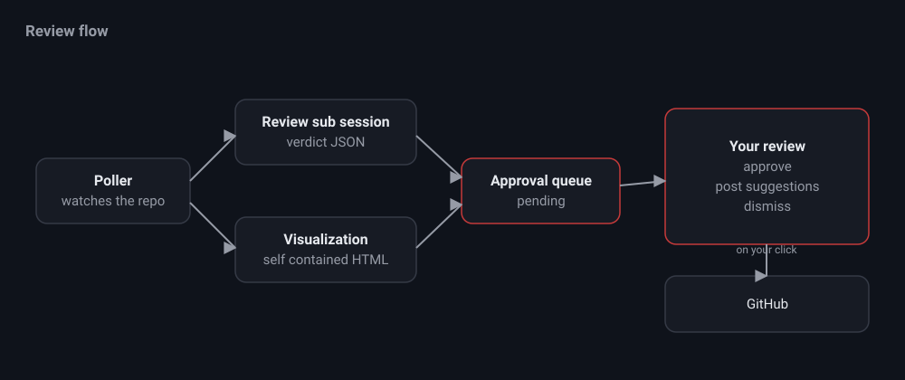

# Review mode

Review mode watches a repository and reviews incoming pull requests, then holds
every verdict for your approval. Posting to GitHub is always gated behind a
button.

## The poll cycle

On each interval the poller lists open PRs and applies the same filters as the
original pr-review-bot:

- Skip merged and draft PRs.
- Skip PRs opened more than `maxAgeDays` days ago.
- Skip your own PRs unless `includeOwn` is set.
- Skip blacklisted authors, and when a whitelist is set, only consider
  whitelisted authors and PR numbers.
- Debounce on the head commit age when `debounceMinutes` is greater than zero.

A PR that was already reviewed is only re-reviewed when there is a new head
commit and all of the previous review threads are resolved. A clean approve with
no comments is never re-reviewed.

## Verdict and visualization

When a PR passes the gate, nit runs two read only pi sub sessions:

- The review sub session returns a JSON verdict, either `approve` or
  `suggestions` with inline comments.
- The visualization sub session returns a self contained HTML document that
  summarizes the change, lists the touched files, and calls out risks. It is
  rendered in a sandboxed iframe.

The verdict lands in the approval queue as pending. You get an in app toast and,
if you allow it, a browser notification.

## Approving

Open a queued item to see the summary, the visualization, and each suggested
inline comment. You can:

- Edit or delete individual comments.
- Approve, which posts `gh pr review --approve` with the summary.
- Post suggestions, which posts a single comment review with the kept comments.
  Each comment is revalidated against the current diff first, so lines that are
  no longer present are dropped rather than rejected by GitHub.
- Dismiss, which records state and posts nothing.

All comment text passes through a sanitizer that strips attribution phrases,
emojis, and em dashes before posting.
